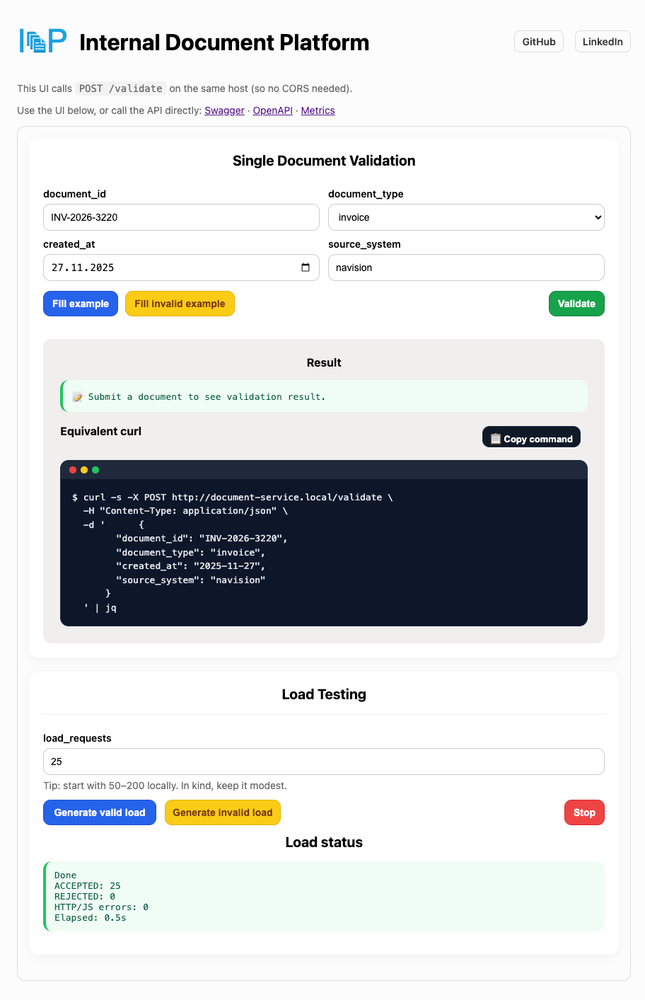
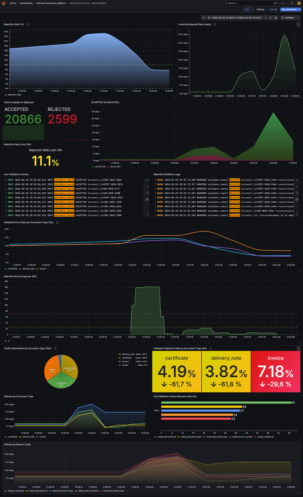
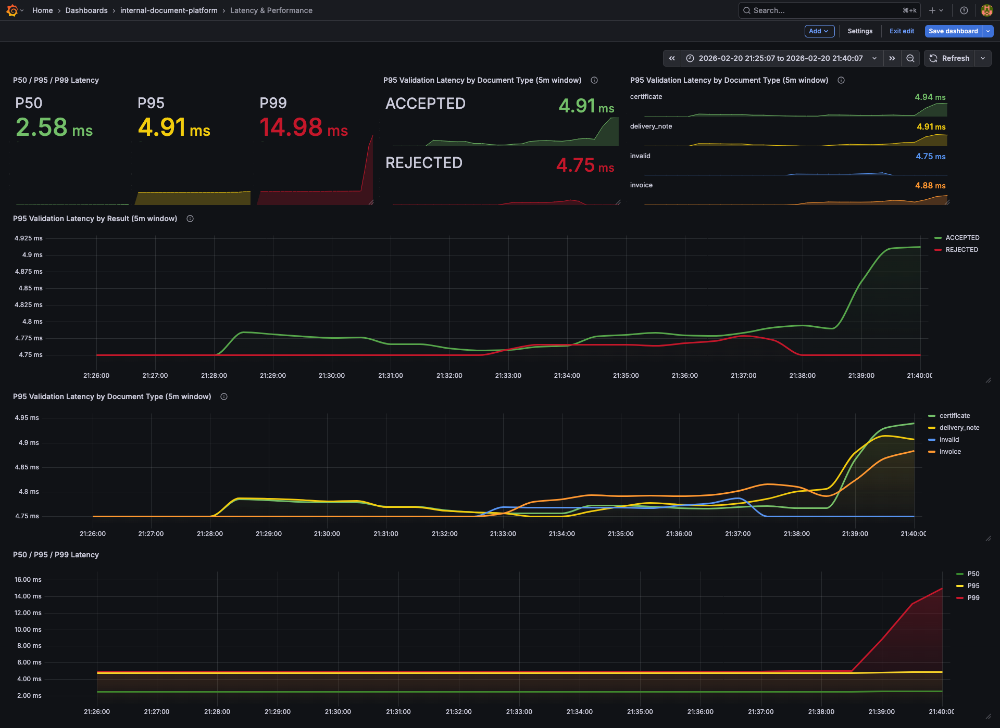

# Internal Document Platform (Document Validation Service)


A cloud-native backend service deployed via **GitOps** (Argo CD) with **CI/CD** (GitHub Actions → GHCR) and full **observability** (Prometheus + Grafana).

---

## What this project demonstrates
- Building a small, real backend service (FastAPI) with production-style endpoints
- Containerization with Docker
- Kubernetes deployment on a local cluster (**kind**)
- Packaging and configuration with **Helm**
- Image build/push automation with **GitHub Actions**
- GitOps-based deployments with **Argo CD**
- Metrics scraping with **Prometheus Operator** via **ServiceMonitor**
- Dashboarding with **Grafana** (traffic + latency panels)

---
## Project scope

This project is intentionally designed as a **local, reproducible platform setup**
to demonstrate modern cloud-native practices (CI/CD, GitOps, observability)
without relying on managed cloud services.

It focuses on correctness, visibility, and automation rather than feature completeness.

## Architecture


---
## What This Repo Contains

### Application

- FastAPI application implementing document validation and metrics instrumentation

  - Location: `app/`

    - `app/main.py` — validation logic + metrics instrumentation
    - `app/ui.html` — validation and traffic simulation interface
    - `app/static/` — UI assets (CSS/JS/logo)
    - `app/requirements.txt` — Python dependencies
    - `app/__init__.py` — application module initialization

  - Tests:

    - `test_validation.py` — unit tests (pytest)

  - Exposed endpoints:

    - `POST /validate` — validates payload and returns `ACCEPTED` or `REJECTED`
    - `GET /metrics` — Prometheus metrics endpoint
    - `GET /health/live` — liveness probe
    - `GET /health/ready` — readiness probe
    - `GET /ui` — validation UI

### Helm Chart

- Kubernetes packaging for the document-service application

  - Location: `helm/document-service/`

    - `templates/deployment.yaml` — Deployment with probes + resource limits
    - `templates/service.yaml` — ClusterIP service definition
    - `templates/servicemonitor.yaml` — Prometheus Operator scraping configuration (ServiceMonitor)
    - `values.yaml` — image reference, replica count, resource configuration

### GitOps

- Argo CD Application manifest (example):
  - `argocd/document-service-app.yaml`

### CI

- GitHub Actions workflow:
  - `.github/workflows/ci.yml`

### Observability

- Exported Grafana dashboards stored as JSON for reproducibility

  - `docs/dashboards/document-validation-service-observability.json`
  - `docs/dashboards/Latency.json`
---

## Service Behavior

### Validation Rules
A request is **ACCEPTED** only if:
- `document_id` is not empty
- `document_type` is one of: `invoice`, `delivery_note`, `certificate`
- `created_at` matches `YYYY-MM-DD`
- `source_system` is not empty

Otherwise it is **REJECTED** with a `reason`.

### Metrics (Prometheus)
Exposed on `/metrics` using `prometheus_client`:

- document_validation_requests_total (Counter)  
  Labels: `result`, `document_type`

- document_validation_failures_total (Counter)  
  Labels: `reason_code`, `document_type`

- document_validation_request_latency_seconds (Histogram)  
  Labels: `result`, `document_type`

To prevent label cardinality explosion:

- Unknown or invalid document types are collapsed into `invalid`
- Rejection reasons are mapped to stable, low-cardinality `reason_code` values

### Validation UI & Traffic Simulation

A lightweight web interface is available at `/ui` for validation testing and traffic simulation.

The UI is designed for controlled validation testing and observability demonstrations. It allows:

- Submitting single document validation requests
- Generating valid or invalid example payloads
- Viewing structured validation results in real time
- Generating batch traffic for load and monitoring verification
- Inspecting the equivalent curl command for API parity



The load testing section enables reproducible traffic generation to validate Prometheus metrics, Grafana dashboards, and logging behavior without requiring external tools. 

It is intentionally designed to support future extension toward more production-like traffic simulation (e.g., mixed valid/invalid ratios, burst patterns, sustained load), enabling controlled experiments on dashboard behavior and alerting thresholds.

---
## Observability Dashboards

The platform includes operational dashboards designed for production-style monitoring and incident analysis.

### Document Service – Observability

Tracks:
- Request rate (req/s)
- Rejection rate (%)
- Accepted vs Rejected trends
- Failure reason distribution
- Traffic distribution by document type



---

### Latency & Performance

Tracks:
- P50 / P95 / P99 latency
- Latency by result (ACCEPTED vs REJECTED)
- Latency by document type



---

These dashboards are based on the metrics exposed in the application:

- `document_validation_requests_total`
- `document_validation_failures_total`
- `document_validation_request_latency_seconds`

The dashboards focus on:
- Detecting quality degradation
- Identifying document-type-specific issues
- Performance regression detection
- Incident triage support
---

## CI/CD & GitOps Automation

This project uses GitHub Actions for CI and Argo CD for GitOps-based deployment.
Git is the single source of truth for the runtime state.

### Pull Request Workflow (Validation)

On pull requests to `main`, the pipeline performs:

- Dependency installation
- Dependency vulnerability scanning (`pip-audit`)
- Unit tests (`pytest`)
- Python compile sanity check
- Container image build
- Container image vulnerability scan (Trivy)

No image is pushed and no deployment is triggered.

This ensures code quality and security before merge.

---

### Push to `main` (Automated Release)

On push to `main`, in addition to validation steps:

1. The container image is built
2. The image is pushed to GitHub Container Registry (GHCR)
3. The image is tagged using the commit SHA (no `latest` tag)
4. `helm/document-service/values.yaml` is automatically updated with the new SHA
5. The updated Helm values are committed back to Git
6. Argo CD detects the declarative state change
7. Kubernetes reconciles automatically

This creates a fully automated GitOps release flow:

`Git → CI → Container Registry → Git (Helm update) → Argo CD → Kubernetes`

No manual image updates or imperative `kubectl apply` commands are required.

---

### Example: Automated Reconciliation in Argo CD

The screenshot below shows the result of a CI-triggered release.

After pushing to `main`:

- CI updated the image tag in `values.yaml`
- The change was committed by `github-actions`
- Argo CD synchronized the application
- The cluster reached `Healthy` and `Synced` state


---

## Quickstart (5 minutes)

### Prerequisites
- Docker Desktop
- kubectl, kind, helm
- (Optional) argocd CLI

### Run locally (Docker)
```bash
docker build -t document-service:0.1.0 .
docker run --rm -p 8000:8000 document-service:0.1.0
```
### Test endpoints

#### Health:

```bash
curl -s http://localhost:8000/health/live && echo
curl -s http://localhost:8000/health/ready && echo
```

#### Validate (Accepted)
```bash
curl -s -X POST http://localhost:8000/validate \
  -H 'Content-Type: application/json' \
  -d '{"document_id":"INV-001","document_type":"invoice","created_at":"2025-01-10","source_system":"erp"}' && echo
```

#### Validate (Rejected)
```bash
curl -s -X POST http://localhost:8000/validate \
  -H 'Content-Type: application/json' \
  -d '{"document_id":"","document_type":"invoice","created_at":"2025-01-10","source_system":"erp"}' && echo
```
#### Metrics
```bash
curl -s http://localhost:8000/metrics | head -n 25
curl -s http://localhost:8000/metrics | grep document_validation_requests_total
```

### Deploy to Kubernetes (kind + Helm)

```bash
kind create cluster --name dev-platform
kubectl get nodes
kubectl create namespace platform
```

### Install via Helm

```bash
helm upgrade --install document-service helm/document-service -n platform
```
### In-cluster verification

Verify Deployment and Service:
```bash
kubectl get deploy,svc -n platform
```

Verify Pods selected by Service:
```bash
kubectl get pods -n platform -l app=document-service
```
> If label selectors return nothing, run: `kubectl get pods -n platform --show-labels` and adjust the selector.

Verify Service endpoints:
```bash
kubectl get endpoints -n platform document-service
```

### Watch pods and check readiness

```bash
kubectl get pods -n platform -w
```

### Check logs (all pods)

```bash
kubectl logs -n platform -l app=document-service
```

### Port-forward service
```bash
kubectl port-forward -n platform svc/document-service 8000:8000
```
---

## GitOps demo (Argo CD): Git changes → cluster updates

### Apply Argo CD Application

```bash
kubectl apply -f argocd/document-service-app.yaml
```

### Watch Argo status

```bash
kubectl port-forward -n argocd svc/argocd-server 8080:443
```
### get Argo CD admin password (first login)

```bash
kubectl -n argocd get secret argocd-initial-admin-secret \
  -o jsonpath="{.data.password}" | base64 --decode && echo
```
Login (user: admin, password: output above):

```bash
argocd login localhost:8080 --username admin --password <PASTE_PASSWORD> --insecure
```

```bash
argocd app get document-service
```
### Sync application (if not auto-sync)

```bash
argocd app sync document-service
argocd app wait document-service
```

### Change replicas in Git and push

Edit : helm/document-service/values.yaml

Example:

```yaml
replicaCount: 4
```

Commit + push:

```bash
git add helm/document-service/values.yaml
git commit -m "gitops: change replicaCount to 4"
git push
```

### Observe Kubernetes reconcile automatically

```bash
kubectl get pods -n platform -w
```

Expected:
**pods get created/terminated until the replica count matches Git.**

## Observability: Prometheus + Grafana verification

### Install Monitoring stack

```bash
helm repo add prometheus-community https://prometheus-community.github.io/helm-charts
helm repo update
kubectl create ns monitoring
helm upgrade --install monitoring prometheus-community/kube-prometheus-stack -n monitoring
```

### Confirm ServiceMonitor exists

```bash
kubectl get servicemonitor -n platform
kubectl describe servicemonitor -n platform document-service
```

### Port-forward Prometheus UI (service name may differ)

```bash
kubectl get svc -n monitoring
```

```bash
kubectl -n monitoring port-forward svc/monitoring-kube-prometheus-prometheus 9090:9090
# or (depending on chart/service)
kubectl -n monitoring port-forward svc/monitoring-kube-prometheus-stack-prometheus 9090:9090
```

Open Prometheus at: http://localhost:9090

Check:

Status → Targets
confirm document-service target is UP

### Generate traffic for graphs
```bash
for i in {1..30}; do
  curl -s -X POST http://localhost:8000/validate \
    -H 'Content-Type: application/json' \
    -d "{\"document_id\":\"INV-$i\",\"document_type\":\"invoice\",\"created_at\":\"2025-01-10\",\"source_system\":\"erp\"}" \
    >/dev/null
done
```

### PromQL queries

**Total Requests :**

```promql
document_validation_requests_total
```

**Requests per second:**

```promql
rate(document_validation_requests_total[1m])
```
**P95 latency (5m window for more stable results):**

```promql
histogram_quantile(0.95, rate(document_validation_request_latency_seconds_bucket[5m]))
```
If p95 shows NaN, there may be too few samples in the time window. Generate more traffic and widen the window.

### Port-forward Grafana and login

List services: 

```bash
kubectl get svc -n monitoring
```

Common Grafana service name:

```bash
kubectl -n monitoring port-forward svc/monitoring-grafana 3000:80
```
Fetch admin password:

```bash
kubectl get secret -n monitoring monitoring-grafana \
  -o jsonpath='{.data.admin-password}' | base64 --decode && echo

```

Open Grafana at : http://localhost:3000

Login:

user: admin
password: (from command above)

---

## Centralized Logging: Loki + Promtail

The project initially focused on metrics based observability using Prometheus and Grafana.  
To complete the observability stack, centralized logging was later added using **Loki** and **Promtail**.

While metrics show what is happening such as traffic and latency, logs explain why it happens, for example why a validation was rejected or whether errors correlate with latency spikes.

---

### Logging Architecture

Application Pods (`platform` namespace)  
→ Promtail (`logging` namespace)  
→ Loki (filesystem storage)  
→ Grafana (`monitoring` namespace)

- Promtail tails Kubernetes container logs automatically
- Loki stores logs locally (filesystem mode)
- Grafana queries Loki via Kubernetes DNS (`loki.logging`)
- No external storage or cloud services are used

---

### Install Loki + Promtail

Create namespace:

```bash
kubectl create namespace logging
```

Add Helm repo:

```bash
helm repo add grafana https://grafana.github.io/helm-charts
helm repo update
```

Install Loki stack:

```bash
helm upgrade --install loki grafana/loki-stack \
  -n logging \
  --set grafana.enabled=false \
  --set promtail.enabled=true \
  --set loki.persistence.enabled=false \
  --set loki.image.tag=2.9.8
```

#### Why Loki 2.9.8?

Older Loki versions (e.g. 2.6.x) fail Grafana datasource health checks due to query endpoint behavior.  
Upgrading to 2.9.8 resolves compatibility issues.

---

### Verify Deployment

Check pods:

```bash
kubectl get pods -n logging
```

Expected:

```
loki-0                1/1 Running
loki-promtail-xxxxx   1/1 Running
```

Verify Loki readiness from Grafana pod:

```bash
kubectl exec -n monitoring deploy/monitoring-grafana -- \
curl http://loki.logging:3100/ready
```

Expected:

```
ready
```

---

### Configure Loki in Grafana

Add new data source:

- **Type:** Loki  
- **URL:** `http://loki.logging:3100`  
- **Authentication:** None  

After saving:

```
Data source successfully connected.
```

---

### Example LogQL Queries

All logs from application namespace:

```logql
{namespace="platform"}
```

Only rejected validations:

```logql
{namespace="platform"} |= "REJECTED"
```

Filter document-service pods:

```logql
{namespace="platform", pod=~"document-service.*"}
```
---

## Key outcomes

- CI builds and publishes container images automatically
- Git is the single source of truth for runtime configuration
- Kubernetes state converges automatically via Argo CD
- Application behavior is observable via metrics, logs, and dashboards

## Non-goals
- No ingress or authentication
- No persistent storage
- No managed cloud services
