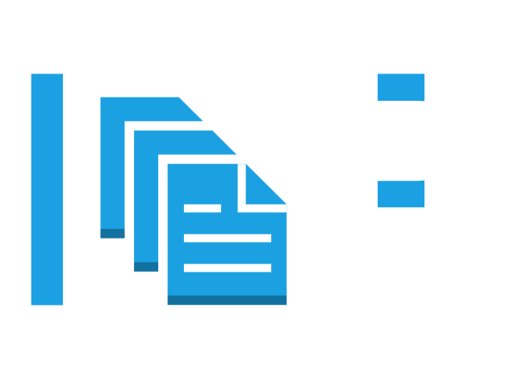

# Internal Document Platform (Document Validation Service)

  

A production-style internal document validation platform modeling enterprise invoicing workflows, deployed via GitOps (Argo CD) with CI/CD (GitHub Actions → GHCR) and full observability (Prometheus + Grafana).

---

## Project Scope

This repository implements a realistic, locally reproducible cloud-native platform that simulates an internal document validation service.

It is designed to demonstrate production-grade practices such as:

- Declarative GitOps deployments
- Automated CI/CD pipelines
- Metrics-driven observability
- Centralized logging
- Kubernetes-native packaging with Helm

The focus is on operational correctness, visibility, and automation rather than business complexity.

## Architecture

---
## Repository Structure

**Application (`app/`)**  
FastAPI service implementing validation logic, metrics instrumentation, and a lightweight traffic simulation UI.

Exposes:
- `POST /validate`
- `GET /metrics`
- `GET /health/*`
- `GET /ui`

**Kubernetes Packaging (`helm/document-service/`)**  
Helm chart defining Deployment, Service, and ServiceMonitor resources.

**GitOps (`argocd/`)**  
Argo CD Application manifest for declarative deployment.

**CI (`.github/workflows/`)**  
GitHub Actions workflow for validation, security scanning, build, and automated GitOps release.

**Local Access (`deploy/local/`)**  
Optional local convenience layer for accessing platform UIs via friendly hostnames.

---

## Documentation

- 🚀 [Local Development Guide](docs/local-development.md)
- 📦 [Repository Structure](docs/repository-structure.md)

---

## Service Behavior

This service models a simplified internal document validation workflow
commonly found in enterprise invoicing systems. Documents such as invoices,
delivery notes, and certificates must pass structural and metadata validation
before being accepted into downstream systems.

### Validation Rules
A request is **ACCEPTED** only if:
- `document_id` is not empty
- `document_type` is one of: `invoice`, `delivery_note`, `certificate`
- `created_at` matches `YYYY-MM-DD`
- `source_system` is not empty

Otherwise it is **REJECTED** with a `reason`.

### Validation UI & Traffic Simulation

A lightweight web interface is available at `/ui` for validation testing and traffic simulation.

The UI is designed for controlled validation testing and observability demonstrations. It allows:

- Submitting single document validation requests
- Generating valid or invalid example payloads
- Viewing structured validation results in real time
- Generating batch traffic for load and monitoring verification
- Inspecting the equivalent curl command for API parity

The load testing section enables reproducible traffic generation to validate Prometheus metrics, Grafana dashboards, and logging behavior without requiring external tools. 

It is intentionally designed to support future extension toward more production-like traffic simulation (e.g., mixed valid/invalid ratios, burst patterns, sustained load), enabling controlled experiments on dashboard behavior and alerting thresholds.

### Metrics (Prometheus)
Exposed on `/metrics` using `prometheus_client`:

- document_validation_requests_total (Counter)  
  Labels: `result`, `document_type`

- document_validation_failures_total (Counter)  
  Labels: `reason_code`, `document_type`

- document_validation_request_latency_seconds (Histogram)  
  Labels: `result`, `document_type`

To prevent label cardinality explosion:

- Unknown or invalid document types are collapsed into `invalid`
- Rejection reasons are mapped to stable, low-cardinality `reason_code` values

---
## Observability Dashboards

The platform includes operational dashboards designed for production-style monitoring and incident analysis.

### Document Service – Observability

Tracks:
- Request rate (req/s)
- Rejection rate (%)
- Accepted vs Rejected trends
- Failure reason distribution
- Traffic distribution by document type

---

### Latency & Performance

Tracks:
- P50 / P95 / P99 latency
- Latency by result (ACCEPTED vs REJECTED)
- Latency by document type

---

These dashboards are based on the metrics exposed in the application:

- `document_validation_requests_total`
- `document_validation_failures_total`
- `document_validation_request_latency_seconds`

The dashboards focus on:
- Detecting quality degradation
- Identifying document-type-specific issues
- Performance regression detection
- Incident triage support
---

## CI/CD & GitOps Automation

This project uses GitHub Actions for CI and Argo CD for GitOps-based deployment.
Git is the single source of truth for the runtime state.

### Pull Request Workflow (Validation)

On pull requests to `main`, the pipeline performs:

- Dependency installation
- Dependency vulnerability scanning (`pip-audit`)
- Unit tests (`pytest`)
- Python compile sanity check
- Container image build
- Container image vulnerability scan (Trivy)

No image is pushed and no deployment is triggered.

This ensures code quality and security before merge.

---

### Push to `main` (Automated Release)

On push to `main`, in addition to validation steps:

1. The container image is built
2. The image is pushed to GitHub Container Registry (GHCR)
3. The image is tagged using the commit SHA (no `latest` tag)
4. `helm/document-service/values.yaml` is automatically updated with the new SHA
5. The updated Helm values are committed back to Git
6. Argo CD detects the declarative state change
7. Kubernetes reconciles automatically

This creates a fully automated GitOps release flow:

`Git → CI → Container Registry → Git (Helm update) → Argo CD → Kubernetes`

No manual image updates or imperative `kubectl apply` commands are required.

---

### Example: Automated Reconciliation in Argo CD

The screenshot below shows the result of a CI-triggered release.

After pushing to `main`:

- CI updated the image tag in `values.yaml`
- The change was committed by `github-actions`
- Argo CD synchronized the application
- The cluster reached `Healthy` and `Synced` state

---

## Centralized Logging: Loki + Promtail

The project initially focused on metrics based observability using Prometheus and Grafana.  
To complete the observability stack, centralized logging was later added using **Loki** and **Promtail**.

While metrics show what is happening such as traffic and latency, logs explain why it happens, for example why a validation was rejected or whether errors correlate with latency spikes.

---

### Logging Architecture

Application Pods (`platform` namespace)  
→ Promtail (`logging` namespace)  
→ Loki (filesystem storage)  
→ Grafana (`monitoring` namespace)

- Promtail tails Kubernetes container logs automatically
- Loki stores logs locally (filesystem mode)
- Grafana queries Loki via Kubernetes DNS (`loki.logging`)
- No external storage or cloud services are used

---

## Key Outcomes

- Fully automated CI pipeline builds, scans, and publishes container images
- Git serves as the single source of truth for runtime configuration (GitOps)
- Kubernetes state reconciles declaratively via Argo CD
- Application behavior is transparently observable through metrics, logs, and dashboards

## Non-goals
- No ingress or authentication
- No persistent storage
- No managed cloud services
