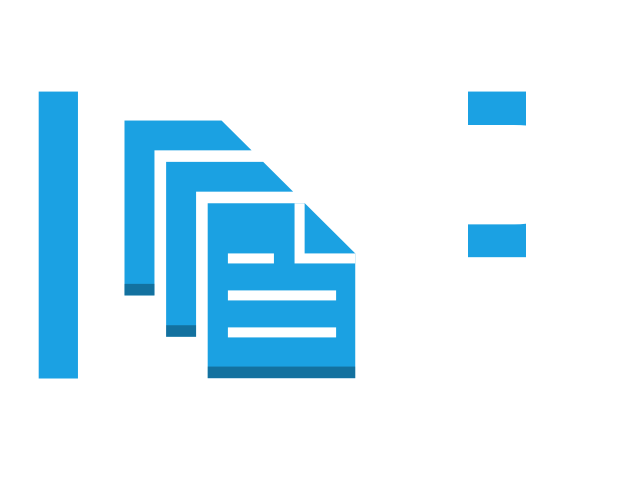
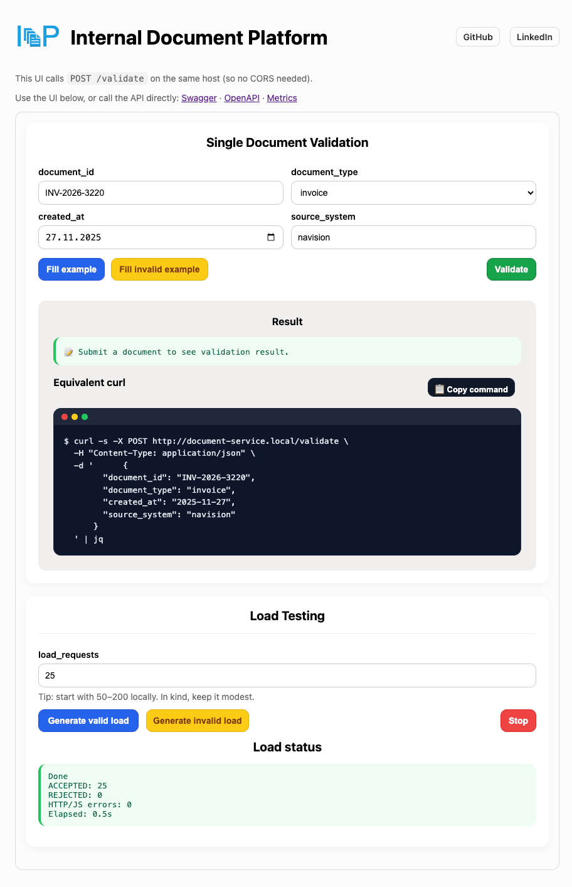
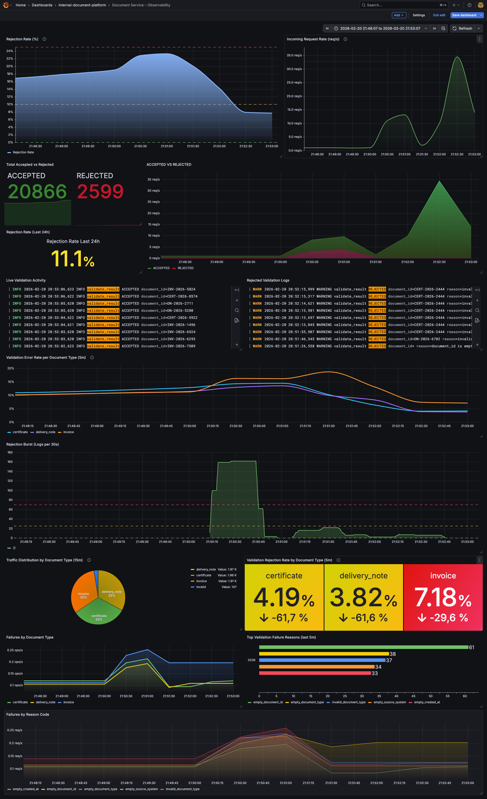
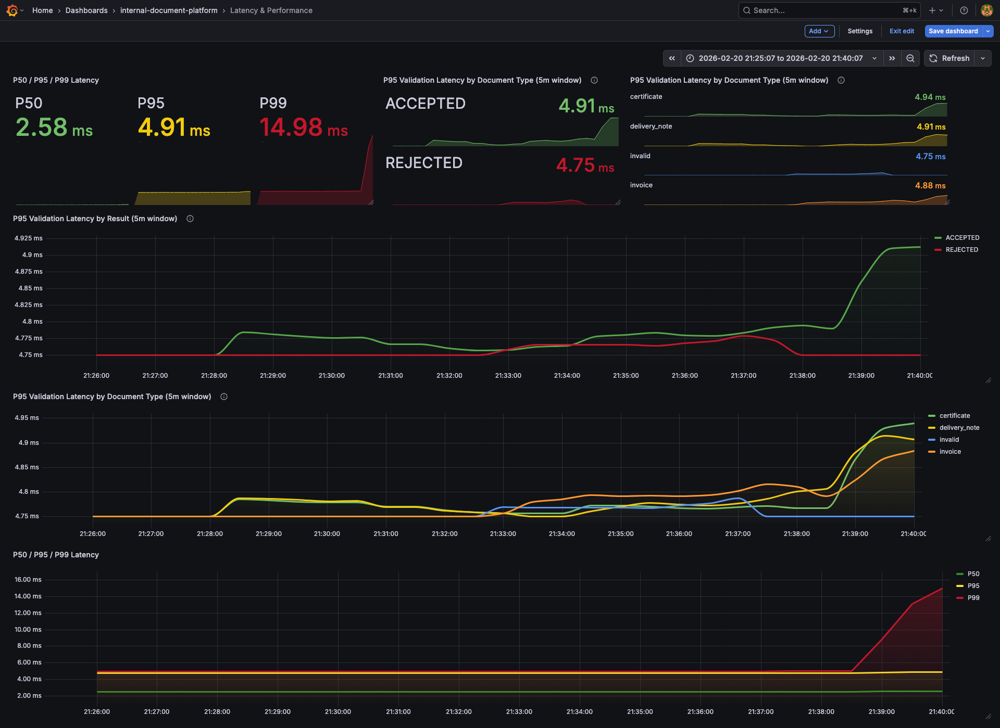
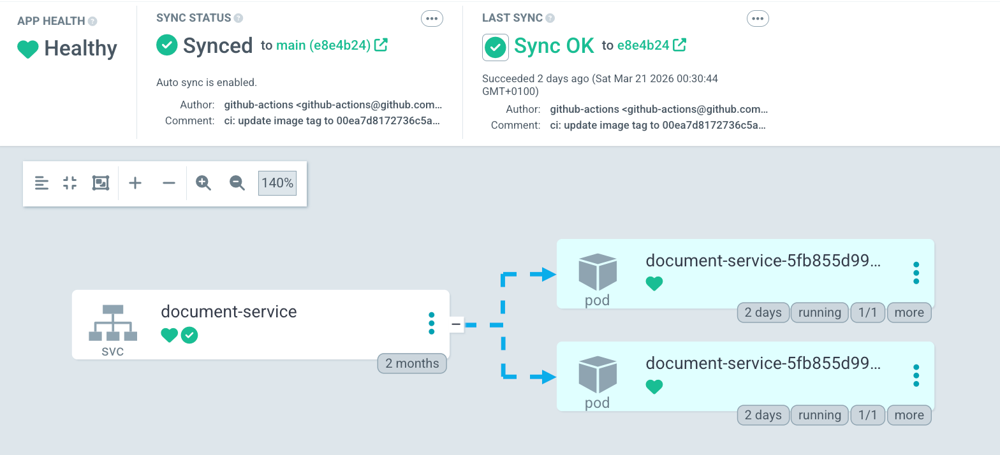
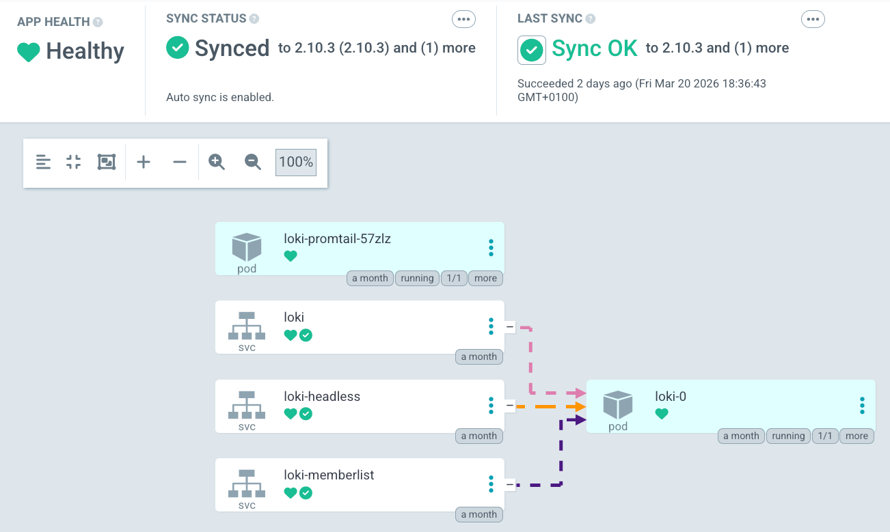
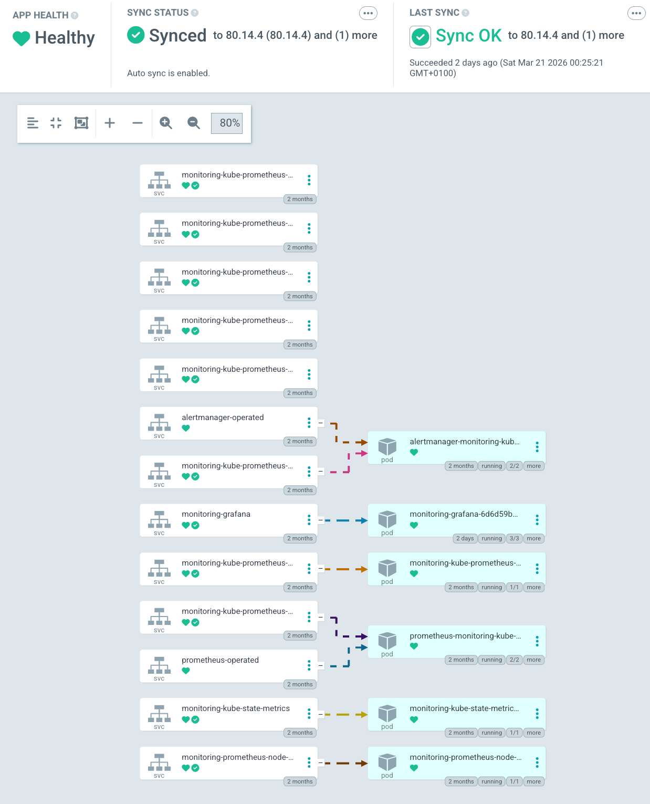

# Internal Document Platform (Document Validation Service)

  

A production-style internal document validation platform modeling enterprise invoicing workflows, deployed via GitOps (Argo CD) with CI/CD (GitHub Actions → GHCR) and full observability (Prometheus + Grafana, and Loki).

## CI/CD Pipeline

  
  
  
  

---

## Project Scope

This repository implements a locally reproducible cloud-native platform simulating an internal document validation service used in enterprise invoicing workflows.

The project focuses on operational practices rather than business complexity, including:

- GitOps-based Kubernetes deployments with Argo CD
- Automated CI/CD pipelines with GitHub Actions
- Metrics and logging for operational visibility
- Kubernetes-native packaging using Helm

## Architecture

---
## Repository Structure

**Application (`app/`)**  
FastAPI service implementing validation logic, metrics instrumentation, and a lightweight traffic simulation UI.

Exposes:
- `POST /validate`
- `GET /metrics`
- `GET /health/*`
- `GET /ui`

**Kubernetes Packaging (`helm/document-service/`)**  
Helm chart defining Deployment, Service, and ServiceMonitor resources.

**GitOps (`argocd/`)**  
Argo CD Application manifest for declarative deployment.

**CI (`.github/workflows/`)**  
GitHub Actions workflow for validation, security scanning, build, and automated GitOps release.

**Local Access (`deploy/local/`)**  
Optional local convenience layer for accessing platform UIs via friendly hostnames.

---

## Documentation

- 🚀 [Local Development Guide](docs/local-development.md)
- 📦 [Repository Structure](docs/repository-structure.md)

---

## Service Behavior

This service models a simplified internal document validation workflow
commonly found in enterprise invoicing systems. Documents such as invoices,
delivery notes, and certificates must pass structural and metadata validation
before being accepted into downstream systems.

### Validation Rules
A request is **ACCEPTED** only if:
- `document_id` is not empty
- `document_type` is one of: `invoice`, `delivery_note`, `certificate`
- `created_at` matches `YYYY-MM-DD`
- `source_system` is not empty

Otherwise it is **REJECTED** with a `reason`.

### Validation UI & Traffic Simulation

A lightweight web interface is available at `/ui` for validation testing and traffic simulation.

The UI is designed for controlled validation testing and observability demonstrations. It allows:

- Submitting single document validation requests
- Generating valid or invalid example payloads
- Viewing structured validation results in real time
- Generating batch traffic for load and monitoring verification
- Inspecting the equivalent curl command for API parity

The load testing section enables reproducible traffic generation to validate Prometheus metrics, Grafana dashboards, and logging behavior without requiring external tools. 

It is intentionally designed to support future extension toward more production-like traffic simulation (e.g., mixed valid/invalid ratios, burst patterns, sustained load), enabling controlled experiments on dashboard behavior and alerting thresholds.

### Metrics (Prometheus)
Exposed on `/metrics` using `prometheus_client`:

- document_validation_requests_total (Counter)  
  Labels: `result`, `document_type`

- document_validation_failures_total (Counter)  
  Labels: `reason_code`, `document_type`

- document_validation_request_latency_seconds (Histogram)  
  Labels: `result`, `document_type`

To prevent label cardinality explosion:

- Unknown or invalid document types are collapsed into `invalid`
- Rejection reasons are mapped to stable, low-cardinality `reason_code` values

---
## Observability Dashboards

The platform includes Grafana dashboards for monitoring service behavior, traffic patterns, validation failures, and latency.

All dashboards are versioned in this repository under the [`/dashboards`](observability/grafana/dashboards/) directory as JSON exports.

### Document Service – Observability

Tracks:
- Request rate (req/s)
- Rejection rate (%)
- Accepted vs Rejected trends
- Failure reason distribution
- Traffic distribution by document type

---

### Latency & Performance

Tracks:
- P50 / P95 / P99 latency
- Latency by result (ACCEPTED vs REJECTED)
- Latency by document type

---

These dashboards are based on the metrics exposed in the application:

- `document_validation_requests_total`
- `document_validation_failures_total`
- `document_validation_request_latency_seconds`

The dashboards focus on:
- Detecting quality degradation
- Identifying document-type-specific issues
- Performance regression detection
- Incident triage support

---

## Centralized Logging: Loki + Promtail

In addition to metrics-based observability, the platform includes centralized logging using **Loki** and **Promtail**.

Metrics reveal service behavior such as request rate and latency, while logs provide detailed context for debugging validation failures and operational issues.

---

### Logging Architecture

- Promtail tails Kubernetes container logs automatically
- Loki stores logs locally (filesystem mode)
- Grafana queries Loki via Kubernetes DNS (`loki.logging`)
- No external storage or cloud services are used

---

## CI/CD & GitOps Automation

This project uses  GitHub Actions for CI and Argo CD for GitOps-based deployments. Git is the single source of truth for the desired runtime state.

---

### Pull Request Workflow (Validation)

On pull requests to `main`, the pipeline performs validation steps only

- Dependency installation
- Dependency vulnerability scanning (`pip-audit`)
- Unit tests (`pytest`)
- Python compile sanity check
- Container image build
- Container image vulnerability scan (Trivy)

No image is pushed and no deployment is triggered.

---

### Push to `main` (Automated Release)

When changes are merged into `main`, the CI pipeline performs the release process:

1. Build the container image
2. Push the image to GitHub Container Registry (GHCR)
3. Tag the image with the commit SHA
4. Update `helm/document-service/values.yaml` with the new image tag
5. Commit the updated Helm values back to Git

Argo CD detects this change in the repository and synchronizes the cluster automatically.

This creates a fully automated GitOps release flow:

No manual image updates or imperative `kubectl apply` commands are required.

---

### GitOps Reconciliation with Argo CD

Argo CD continuously reconciles the Kubernetes cluster with the declarative configuration stored in this repository.

The platform defines multiple Argo CD applications in the `argocd/` directory:

- `document-service` – the validation service deployed from the internal Helm chart
- `monitoring` – the observability stack (Prometheus, Grafana, Alertmanager)
- `loki` – the logging stack (Loki + Promtail)

Each application is defined as an Argo CD Application resource referencing a Helm chart and configuration values stored in the repository.

Argo CD monitors these definitions and ensures that the cluster state matches the declared configuration.  
If drift occurs, the controller automatically reconciles the cluster back to the desired state.

The screenshots below show the applications after synchronization, reaching the **Healthy** and **Synced** state.

### Argo CD Applications

The platform is composed of multiple Argo CD applications managed through GitOps.

#### Document Service

#### Logging Stack (Loki)

#### Monitoring Stack

---

## Key Outcomes

- Fully automated CI pipeline builds, scans, and publishes container images
- Git serves as the single source of truth for runtime configuration (GitOps)
- Kubernetes state reconciles declaratively via Argo CD
- Application behavior is transparently observable through metrics, logs, and dashboards

## Non-goals
- No ingress or authentication
- No persistent storage
- No managed cloud services
