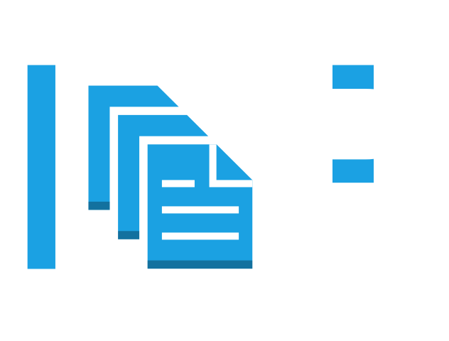
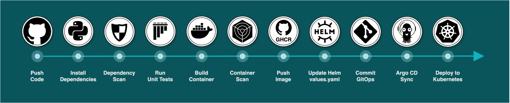
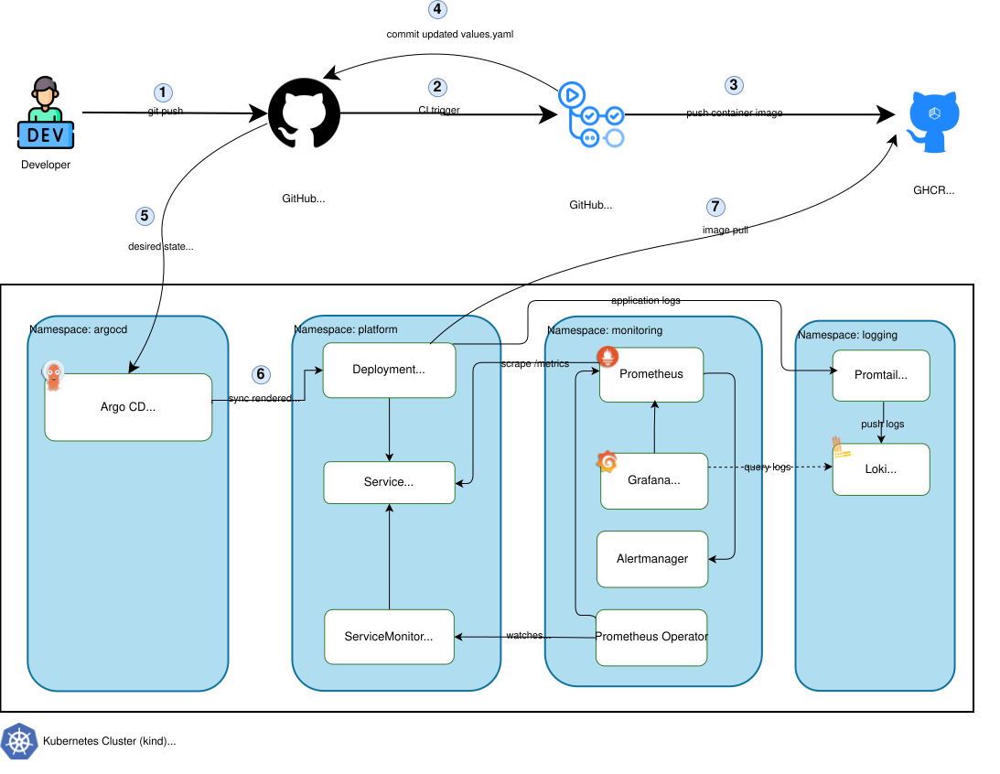
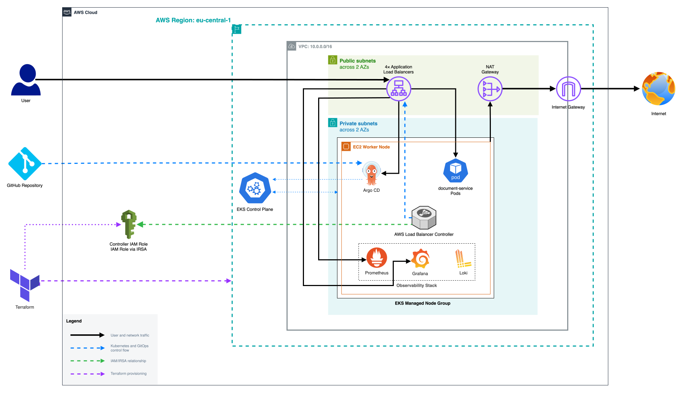
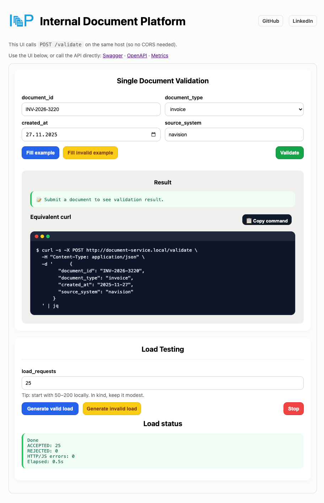
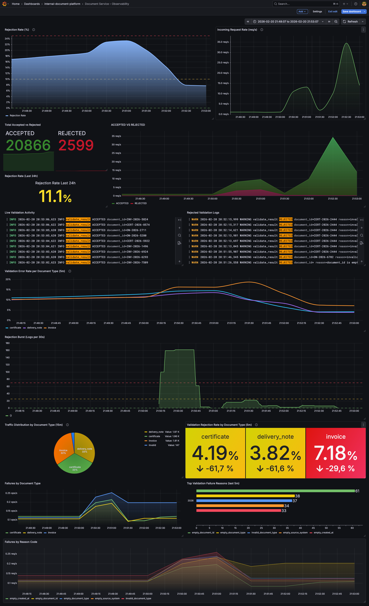
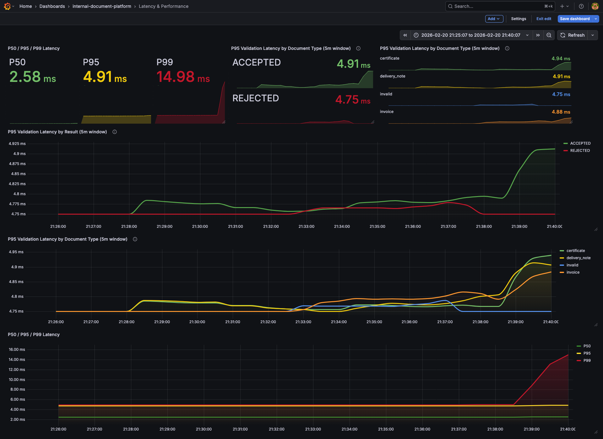
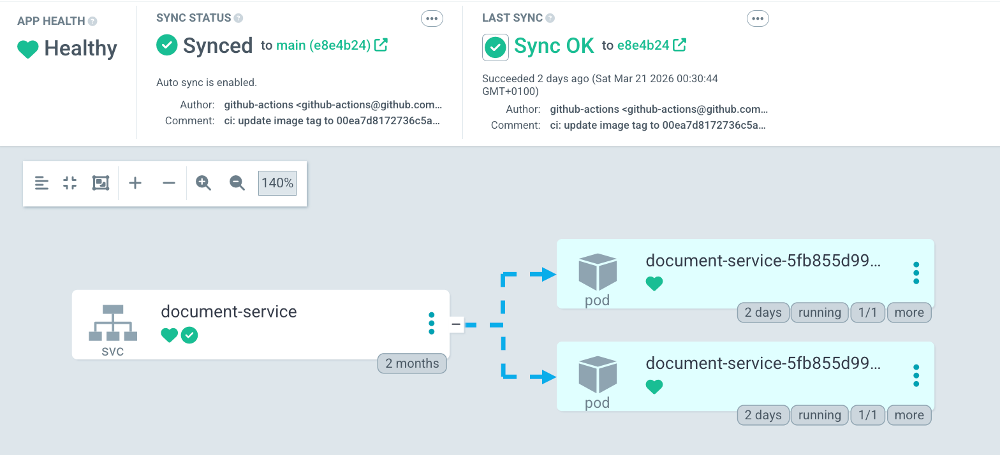
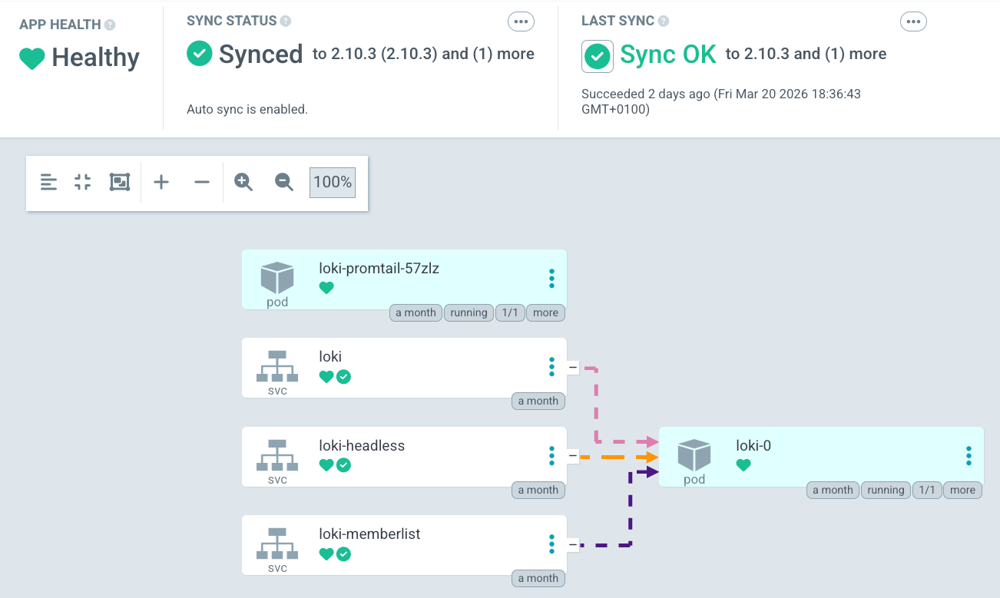
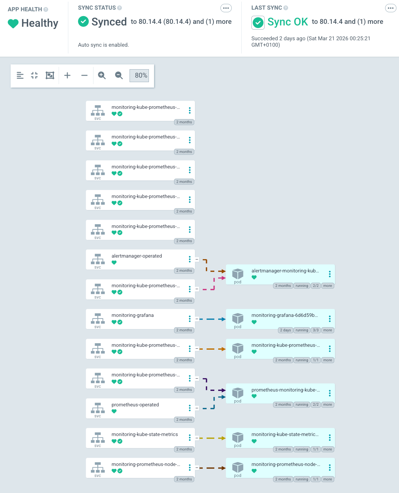

# Internal Document Platform (Document Validation Service)

  

A production-style, demo-grade internal document validation platform modeling
enterprise invoicing workflows.

The project demonstrates AWS EKS infrastructure, Kubernetes delivery with
GitOps, automated CI/CD, and full-stack observability with Prometheus, Grafana,
Loki, and Promtail. It is built as a portfolio-ready reference implementation,
not as a production-ready service.

  
  
  
  

---

## Project Scope

This repository implements a cloud-native platform that simulates an internal
document validation service used in enterprise invoicing workflows.

The project started with a local KinD-based Kubernetes environment to validate
the application, Helm chart, Argo CD deployment flow, and CI/CD feedback loop in
a fast, reproducible setup. After proving that workflow locally, the platform
was extended to AWS EKS with Terraform-managed infrastructure and the same
GitOps delivery model.

The project focuses on operational practices rather than business complexity,
including:

- Local Kubernetes validation with KinD during the first project phase
- AWS infrastructure provisioned with Terraform, including VPC networking and
  an EKS cluster
- Kubernetes-native packaging with Helm
- GitOps-based deployments and reconciliation with Argo CD
- CI/CD automation with GitHub Actions and GitHub Container Registry
- Metrics, logs, and dashboards for operational visibility

## Architecture

The project has two complementary architecture views:

- The local validation and delivery view shows how GitHub Actions, GHCR, Helm,
  Argo CD, and Kubernetes worked together during the KinD-based project phase.
- The cloud runtime view shows the AWS EKS environment, Terraform-managed
  infrastructure, Kubernetes workloads, ingress path, and observability stack.

### Local Validation and GitOps Delivery

### Cloud Runtime Architecture

---
## Repository Structure

**Application ([`app/`](app/))**
FastAPI service implementing validation logic, metrics instrumentation, health
checks, and a lightweight traffic simulation UI.

**Application Helm Chart ([`helm/document-service/`](helm/document-service/))**
Kubernetes packaging for the validation service, including Deployment, Service,
Ingress, ServiceMonitor, default local values, and EKS override values.

**Platform Helm Values ([`helm/platform-values/`](helm/platform-values/))**
Versioned values for platform charts used by Argo CD, including
kube-prometheus-stack, Loki, and the AWS Load Balancer Controller.

**GitOps ([`argocd/`](argocd/))**
Argo CD Application manifests for the local and EKS deployment paths. The EKS
manifests declare the document service, monitoring stack, Loki stack, AWS Load
Balancer Controller, observability dashboard config, and UI ingress resources.

**Infrastructure ([`infra/`](infra/))**
Terraform and lifecycle scripts for the AWS environment. Terraform defines the
VPC, subnets, EKS cluster, managed node group, IAM resources, and load balancer
controller integration. The apply and destroy scripts coordinate provisioning,
Argo CD bootstrap, workload deployment, smoke testing, and teardown.

**Observability Config ([`observability/grafana/`](observability/grafana/))**
Grafana dashboard JSON and a small Helm chart that packages dashboards into
ConfigMaps for GitOps-managed provisioning.

**CI/CD ([`.github/workflows/`](.github/workflows/))**
GitHub Actions workflows for application validation, image build and release,
infrastructure validation, documentation link checks, vulnerability scanning,
and GitOps image tag updates.

**Local Access ([`deploy/local/`](deploy/local/))**
Optional local convenience layer for accessing platform UIs via friendly hostnames.

---

## Documentation

- 🚀 [Local Development Guide](docs/local-development.md) - run the FastAPI
  service, Docker image, and local validation endpoints.
- ☁️ [AWS EKS Deployment Guide](docs/eks-deployment.md) - create, verify, and
  destroy the AWS EKS demo environment.
- 📦 [Repository Structure](docs/repository-structure.md) - understand the
  purpose of the main directories and platform components.
- 🛠️ [Infrastructure Operations Guide](infra/README.md) - use the Terraform,
  apply, destroy, skip-flag, and recovery workflows.

---

## Service Behavior

This service models a simplified internal document validation workflow
commonly found in enterprise invoicing systems. Documents such as invoices,
delivery notes, and certificates must pass structural and metadata validation
before being accepted into downstream systems.

### API Endpoints

- `POST /validate` validates a document payload and returns an accepted or
  rejected result.
- `GET /metrics` exposes Prometheus metrics for scraping.
- `GET /health/*` exposes service health checks.
- `GET /ui` opens the lightweight validation and traffic simulation UI.

### Validation Rules
A request is **ACCEPTED** only if:
- `document_id` is not empty
- `document_type` is one of: `invoice`, `delivery_note`, `certificate`
- `created_at` matches `YYYY-MM-DD`
- `source_system` is not empty

Otherwise it is **REJECTED** with a `reason`.

### Validation UI & Traffic Simulation

A lightweight web interface is available at `/ui` for validation testing and
traffic simulation.

The UI is designed for controlled validation testing and observability
demonstrations. It allows:

- Submitting single document validation requests
- Generating valid or invalid example payloads
- Viewing structured validation results in real time
- Generating batch traffic for load and monitoring verification
- Inspecting the equivalent curl command for API parity

The load testing section enables reproducible traffic generation to validate
Prometheus metrics, Grafana dashboards, and logging behavior without requiring
external tools.

It is intentionally designed to support future extension toward more
production-like traffic simulation, such as mixed valid/invalid ratios, burst
patterns, and sustained load. That enables controlled experiments on dashboard
behavior and alerting thresholds.

### Metrics (Prometheus)
Exposed on `/metrics` using `prometheus_client`:

- document_validation_requests_total (Counter)
  Labels: `result`, `document_type`

- document_validation_failures_total (Counter)
  Labels: `reason_code`, `document_type`

- document_validation_request_latency_seconds (Histogram)
  Labels: `result`, `document_type`

To prevent label cardinality explosion:

- Unknown or invalid document types are collapsed into `invalid`
- Rejection reasons are mapped to stable, low-cardinality `reason_code` values

---
## Observability Dashboards

The platform includes Grafana dashboards for monitoring service behavior,
traffic patterns, validation failures, log activity, and latency.

The dashboards are designed to answer four operational questions:

- Is the service receiving traffic?
- Are documents being accepted or rejected at unusual rates?
- Which document types or validation reasons are causing failures?
- Is validation latency staying within an expected range?

### Document Service - Observability

This dashboard focuses on validation outcomes and operational triage. It helps
show whether traffic is flowing, whether rejections are increasing, and which
document types or reason codes are contributing to failures.

### Latency & Performance

This dashboard focuses on performance behavior. It highlights percentile
latency and helps identify whether slowdowns are connected to validation
results or specific document types.

### Dashboard Inputs

The dashboards are based on the metrics exposed by the application:

- `document_validation_requests_total`
- `document_validation_failures_total`
- `document_validation_request_latency_seconds`

Log panels use the GitOps-provisioned Loki datasource with the stable UID
`loki`.

### Dashboard Inventory

| Dashboard | Purpose | Main Signals |
|---|---|---|
| Document Service - Observability | Tracks validation behavior and traffic quality | Request rate, rejection rate, accepted/rejected trends, failure reasons, document-type distribution |
| Latency & Performance | Tracks service response-time behavior | P50/P95/P99 latency, latency by validation result, latency by document type |

### GitOps Provisioning

Dashboard provisioning is managed declaratively through these files:

- [`observability/grafana/dashboards/`](observability/grafana/dashboards/)
  stores the Grafana dashboard JSON exports.
- [`observability/grafana/Chart.yaml`](observability/grafana/Chart.yaml)
  defines the small internal Helm chart used for dashboard packaging.
- [`observability/grafana/templates/dashboard-configmaps.yaml`](observability/grafana/templates/dashboard-configmaps.yaml)
  renders each dashboard JSON file as a ConfigMap labeled
  `grafana_dashboard: "1"`.
- [`argocd/observability-config-app-eks.yaml`](argocd/observability-config-app-eks.yaml)
  tells Argo CD to reconcile those dashboard ConfigMaps into the `monitoring`
  namespace.

Grafana's dashboard sidecar watches for the labeled ConfigMaps, so dashboard
changes can be synchronized and restored by Argo CD.

### Validation Checks

- `observability-config-eks` syncs successfully in Argo CD
- Dashboard ConfigMaps are created in the `monitoring` namespace
- Dashboards appear in Grafana without manual import
- Deleting a dashboard ConfigMap is corrected by Argo CD self-healing

---

## Centralized Logging: Loki + Promtail

In addition to metrics-based observability, the platform includes centralized
logging using **Loki** and **Promtail**.

Metrics reveal service behavior such as request rate and latency, while logs
provide detailed context for debugging validation failures and operational
issues.

---

### Logging Architecture

- Promtail tails Kubernetes container logs automatically
- Loki stores logs locally (filesystem mode)
- Grafana queries Loki through Kubernetes DNS:
  - Local/KinD: `http://loki.logging:3100`
  - EKS: `http://loki-eks.logging:3100`
- Grafana provisions the Loki datasource with the stable UID `loki`
- No external storage or cloud services are used

---

## CI/CD & GitOps Automation

This project uses GitHub Actions for CI and Argo CD for GitOps-based
deployments. Git is the single source of truth for the desired runtime state.

### Validation Coverage

| Area | Checks |
|---|---|
| Python application | Ruff linting and formatting, pytest, Python compile check |
| Dependencies and secrets | pip-audit, Gitleaks |
| Container image | Docker build, containerized tests, readiness smoke test, Trivy image scan |
| Dockerfile | Hadolint |
| Helm and Kubernetes | Helm lint/template, kubeconform schema validation, Argo CD manifest validation |
| Terraform | terraform fmt, terraform init -backend=false, terraform validate, TFLint, Trivy config scan |
| Documentation | Lychee link checking for README and Markdown docs |

---

### Pull Request Workflow

On pull requests to `main`, the workflows validate changes without publishing a
new runtime image or deploying to the cluster.

Application changes run the app pipeline, infrastructure changes run the infra
validation pipeline, and documentation changes run the docs validation
pipeline.

---

### Push to `main` (Automated Release)

When changes are merged into `main`, the CI pipeline performs the release process:

1. Build the container image
2. Push the image to GitHub Container Registry (GHCR)
3. Tag the image with the commit SHA
4. Update `helm/document-service/values.yaml` with the new image tag
5. Commit the updated Helm values back to Git

Argo CD detects this change in the repository and synchronizes the cluster automatically.

This creates a fully automated GitOps release flow:

No manual image updates or imperative `kubectl apply` commands are required.

---

### GitOps Reconciliation with Argo CD

Argo CD continuously reconciles the Kubernetes cluster with the declarative configuration stored in this repository.

The platform defines multiple Argo CD applications in the `argocd/` directory:

- `document-service` / `document-service-eks` – the validation service
  deployed from the internal Helm chart
- `monitoring` / `monitoring-eks` – the observability stack with Prometheus and
  Grafana
- `loki` / `loki-eks` – the logging stack with Loki and Promtail
- `observability-config-eks` – GitOps-managed Grafana dashboard ConfigMaps
- `aws-load-balancer-controller-eks` – AWS ALB integration for EKS ingress

Each application is defined as an Argo CD Application resource referencing a
Helm chart and configuration values stored in the repository.

Argo CD monitors these definitions and ensures that the cluster state matches
the declared configuration. If drift occurs, the controller automatically
reconciles the cluster back to the desired state.

The screenshots below show the applications after synchronization, reaching the **Healthy** and **Synced** state.

### Argo CD Applications

The platform is composed of multiple Argo CD applications managed through GitOps.

#### Document Service

#### Logging Stack (Loki)

#### Monitoring Stack

---

## Key Outcomes

- Fully automated CI pipeline builds, scans, and publishes container images
- Git serves as the single source of truth for runtime configuration (GitOps)
- Kubernetes state reconciles declaratively via Argo CD
- Application behavior is transparently observable through metrics, logs, and dashboards

## Current Limitations

- The EKS environment is a demo-grade fixed-size cluster, not a production
  environment.
- Browser-facing endpoints currently use temporary AWS ALB DNS names.
- Custom domains, public HTTPS/TLS, SSO/RBAC, and hardened administrative
  access are deferred to a later release.
- Loki uses local filesystem storage instead of durable external object
  storage.
- Autoscaling, multi-environment promotion, formal SLOs, and production
  persistence are intentionally out of scope for the current release.

## Non-goals
- This is a portfolio-grade platform demonstration, not a production-ready
  service.
- Public HTTPS/TLS access, custom domains, and authentication are intentionally
  deferred to a later release.
- Multi-environment promotion, autoscaling, managed persistence, and formal SLOs
  are outside the current release scope.
